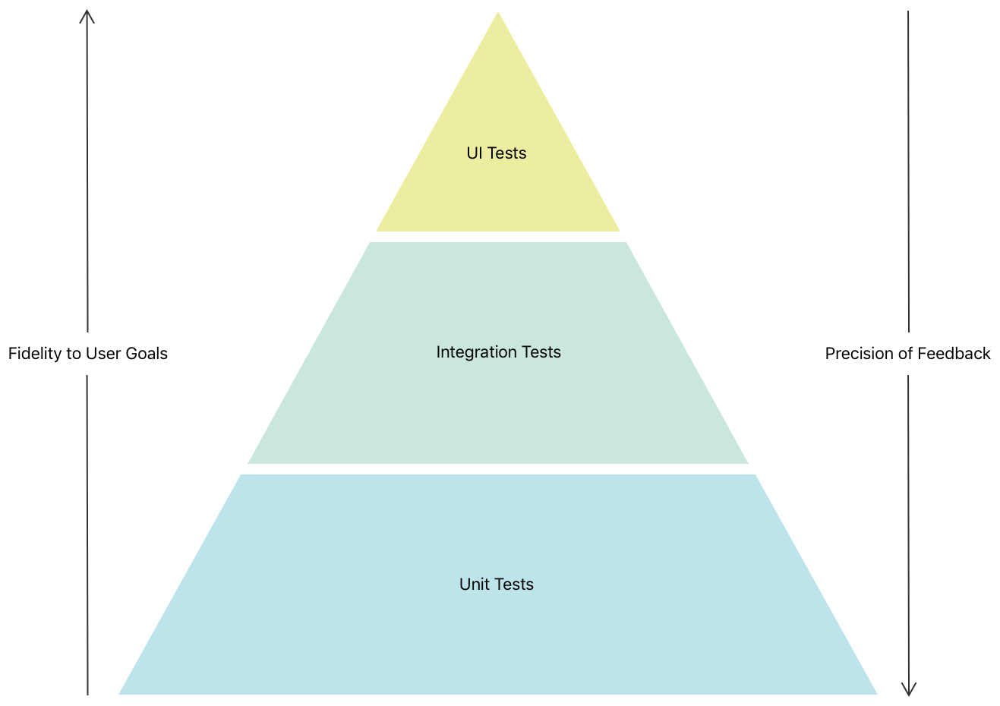
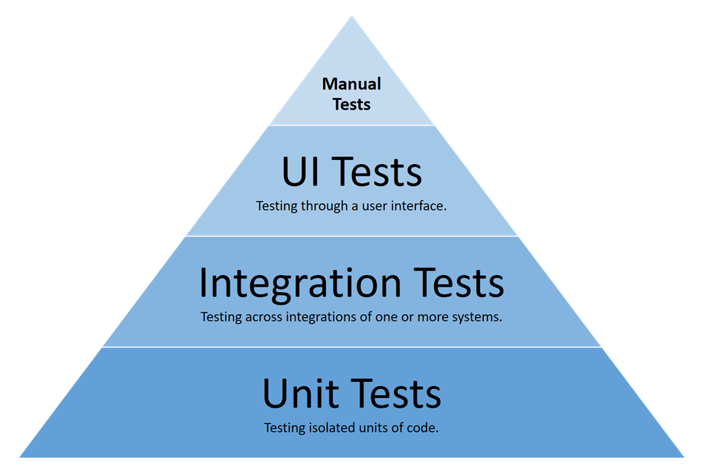

There are many types of tests you can add to assure the highest possible quality of your app. They each serve a different purpose and cover different components of your code. When you decide to add more tests to your app, how should we utilize all these tests in the app?

## Testing Strategy

A good practice is to come up with a testing strategy that combines multiple types of tests, so that we can maximize the benefits of each. But that doesn’t mean you should write the same amout of tests for each type. The image shows a pyramid distribution of different tests

* A large number of well-isolated and fast unit tests to cover your app’s business logic
* A small number of integration tests to demonstrate that smaller parts are connected together as expected
* A smaller number of UI tests to assert the correct behavior of core user flows
* If there’s enough resource, we can also perform manual tests on top of that.

## Maturity of testing

Another good practice is to measure the testing maturity of your app

* Adhoc - We have some tests, mainly we find out if stuff breaks through alarms
* Basic - We have a strategy, we have enough tests as a safety net for our core experience
* Mature - Executing the strategy, most features of the experience are covered

We will cover each type of tests in more details in the following articles.